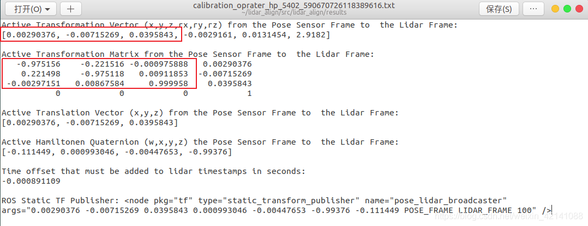

# 3_Calibration_pkg
> Latest update  --  2025.12.30
> 
> 系统：Ubuntu 20.04 , ROS Noetic
>

## > IMU标定内参
-[使用imu_utils工具标定imu的内参](https://blog.csdn.net/weixin_53073284/article/details/123341141?ops_request_misc=%257B%2522request%255Fid%2522%253A%2522166599541116800182714192%2522%252C%2522scm%2522%253A%252220140713.130102334..%2522%257D&request_id=166599541116800182714192&biz_id=0&utm_medium=distribute.pc_search_result.none-task-blog-2~all~baidu_landing_v2~default-4-123341141-null-null.142^v58^pc_search_tree,201^v3^control_1&utm_term=imu_utils%E6%A0%87%E5%AE%9A&spm=1018.2226.3001.4187)
>Denpendent
```
sudo apt-get install libdw-dev
```
>Ceres Install

-[Ceres Solver Document](http://ceres-solver.org/installation.html#linux)

-[Ceres Solver Google](https://ceres-solver.googlesource.com/ceres-solver)

依赖安装：
```
# CMake
sudo apt-get install cmake
# google-glog + gflags
sudo apt-get install libgoogle-glog-dev libgflags-dev
# BLAS & LAPACK
sudo apt-get install libatlas-base-dev
# Eigen3
sudo apt-get install libeigen3-dev
# SuiteSparse and CXSparse (optional)
sudo apt-get install libsuitesparse-dev
```
使用
```
git clone https://ceres-solver.googlesource.com/ceres-solver
```
克隆的ceres最新版本与eigen3不匹配需要在上面官网链接的version history下找到ceres1.14.0版本下载并解压到home下。

-[cere 1.14.0](https://github.com/Fontainebleau2021/ceres1.14.0.git)
```
git clone https://github.com/Fontainebleau2021/ceres1.14.0.git
cd ceres1.14.0
mkdir build
cd build
cmake ..
make
sudo make install
```
>code_utils

（imu_utils 依赖 code_utils所以先把code_utils放在工作空间的src下面编译然后再将imu_utils放到src下编译）新建工作空间将下载的code_utils解压放在src下，在imu_utils/src/code_utils/下打开sumpixel_test.cpp文件修改#include "backward.hpp"为 #include “code_utils/backward.hpp

-[code_utils](https://github.com/gaowenliang/code_utils)
```
cd ~/catkin_ws/src
git clone https://github.com/gaowenliang/code_utils
cd ..
catkin_make
```
>imu_utils

-[imu_utils](https://github.com/gaowenliang/imu_utils)

code_utils编译成功后把imu_utils放到工作空间的src下面，进行编译。
```
cd ~/catkin_ws/src
git clone https://github.com/gaowenliang/imu_utils
cd ..
catkin_make
```
>录制imu数据包

<font color='red'> 全程保持imu静止不动 </font>，imu上电运行十分钟后开始录制，录制两个小时。
```
rosbag record -O imu.bag /imu/data
```
>标定imu

<font color='red'> 标定过程imu不要运行！！！ </font>在 imu_utils/src/imu_utils/launch/下找到xsense.launch,修改imu_topic和max_time_min，其中max_time_min两小时就设为120，启动launch文件。
```
source  devel/setup.bash
roslaunch imu_utils xsense.launch
```
播放imu的bag。
```
//-r200:以两百倍速播放imu包
rosbag play -r200  imu.bag
```
播包结束时才会显示标定完成，标定结果在data文件夹下会生成一堆文件我们需要的是第一个标定结束，标定结果存在imu_utils/src/imu_utils/data/下xsense_imu_param.yaml

>liosam参数的相关修改
配置文件生成后的对应关系为：
```
  // Acc误差模型高斯白噪声
  imuAccNoise<---------->acc_n 
  // Gyro误差模型高斯白噪声
  imuGyrNoise<----------> gyr_n
  // Acc误差模型随机游走噪声
  imuAccBiasN<---------->acc_w
  // Gyro误差模型随机游走噪声
  imuGyrBiasN<----------> gyr_w
```

## > Lidar和IMU联合标定

使用lidar-align进行联合标定

-[lidar-align](https://github.com/ethz-asl/lidar_align)

参考：

-[激光雷达和IMU联合标定并运行LIOSAM](https://blog.csdn.net/cyx610481953/article/details/115265585)

-[LIO-SAM运行自己数据包遇到的问题解决](https://blog.csdn.net/weixin_42141088/article/details/118000544?ops_request_misc=&request_id=&biz_id=102&utm_term=lio%20sam%20imu%E6%A0%87%E5%AE%9A&utm_medium=distribute.pc_search_result.none-task-blog-2~all~sobaiduweb~default-4-118000544.142^v59^pc_rank_34_queryrelevant25,201^v3^control_1&spm=1018.2226.3001.4187)

>Install
```
cd /catkin_ws/src
git clone https://github.com/ethz-asl/lidar_align.git
catkin_make
```
- 第一次编译会报错nlopt库
```
sudo apt-get install libnlopt-dev
```
将NLOPTConfig.cmake文件移动到 lidar_align/src/ 下,并在CMakeLists.txt里加上这样一句话：
```
list(APPEND CMAKE_FIND_ROOT_PATH ${PROJECT_SOURCE_DIR})
set (CMAKE_PREFIX_PATH "/usr/local/lib/cmake/nlopt")
```
- 第二次编译会报定义冲突问题,依次运行以下指令
```
sudo mv /usr/include/flann/ext/lz4.h /usr/include/flann/ext/lz4.h.bak

sudo mv /usr/include/flann/ext/lz4hc.h /usr/include/flann/ext/lz4.h.bak

sudo ln -s /usr/include/lz4.h /usr/include/flann/ext/lz4.h

sudo ln -s /usr/include/lz4hc.h /usr/include/flann/ext/lz4hc.h

catkin_make
```
- 编译成功后，改写IMU接口。因为这一工具原本不是用来标定激光雷达和IMU的而是用来标定激光雷达和里程计的。所以需要改写IMU接口来替换掉里程计接口。打开loader.cpp文件：
```
//找到以下odom部分注释删掉都可
/*  types.push_back(std::string("geometry_msgs/TransformStamped"));
  rosbag::View view(bag, rosbag::TypeQuery(types));

  size_t tform_num = 0;
  for (const rosbag::MessageInstance& m : view) {
    std::cout << " Loading transform: \e[1m" << tform_num++
              << "\e[0m from ros bag" << '\r' << std::flush;

    geometry_msgs::TransformStamped transform_msg =
        *(m.instantiate<geometry_msgs::TransformStamped>());

    Timestamp stamp = transform_msg.header.stamp.sec * 1000000ll +
                      transform_msg.header.stamp.nsec / 1000ll;

    Transform T(Transform::Translation(transform_msg.transform.translation.x,
                                       transform_msg.transform.translation.y,
                                       transform_msg.transform.translation.z),
                Transform::Rotation(transform_msg.transform.rotation.w,
                                    transform_msg.transform.rotation.x,
                                    transform_msg.transform.rotation.y,
                                    transform_msg.transform.rotation.z));
    odom->addTransformData(stamp, T);
  }
*/

//将以上部分替换为：

    types.push_back(std::string("sensor_msgs/Imu"));
    rosbag::View view(bag, rosbag::TypeQuery(types));
    size_t imu_num = 0;
    double shiftX=0,shiftY=0,shiftZ=0,velX=0,velY=0,velZ=0;
    ros::Time time;
    double timeDiff,lastShiftX,lastShiftY,lastShiftZ;
    for (const rosbag::MessageInstance& m : view){
      std::cout <<"Loading imu: \e[1m"<< imu_num++<<"\e[0m from ros bag"<<'\r'<< std::flush;

      sensor_msgs::Imu imu=*(m.instantiate<sensor_msgs::Imu>());

      Timestamp stamp = imu.header.stamp.sec * 1000000ll +imu.header.stamp.nsec / 1000ll;
      if(imu_num==1){
         time=imu.header.stamp;
             Transform T(Transform::Translation(0,0,0),Transform::Rotation(1,0,0,0));
         odom->addTransformData(stamp, T);
     }
     else{
         timeDiff=(imu.header.stamp-time).toSec();
         time=imu.header.stamp;
         velX=velX+imu.linear_acceleration.x*timeDiff;
         velY=velX+imu.linear_acceleration.y*timeDiff;
         velZ=velZ+(imu.linear_acceleration.z-9.801)*timeDiff;

         lastShiftX=shiftX;
         lastShiftY=shiftY;
         lastShiftZ=shiftZ;
         shiftX=lastShiftX+velX*timeDiff+imu.linear_acceleration.x*timeDiff*timeDiff/2;
         shiftY=lastShiftY+velY*timeDiff+imu.linear_acceleration.y*timeDiff*timeDiff/2;
         shiftZ=lastShiftZ+velZ*timeDiff+(imu.linear_acceleration.z-9.801)*timeDiff*timeDiff/2;

         Transform T(Transform::Translation(shiftX,shiftY,shiftZ),
                Transform::Rotation(imu.orientation.w,
                         imu.orientation.x,
                         imu.orientation.y,
                         imu.orientation.z));
         odom->addTransformData(stamp, T);
     }
    }

//并在开头添加头文件：

#include <sensor_msgs/Imu.h>
```
>录制数据以及标定
需同时录制激光雷达和IMU两分钟即可，最好将数据量控制到2G以内，超出2G之外可能出现未知错误无法标定。两分钟的数据应该尽量包含较大的旋转量和平移量（也就是先直线跑一段再转两圈），这样标出来的误差结果比较好。

打开lidar_align.launch文件，将两分钟的数据包路经copy输入进去。改写了接口以后就不用以表格形式导入数据了，直接播放在launch文件里面修改你的数据包的路径即可。标定时间可能较长，一个小时多点吧，需要迭代将近300次左右
```
source devel/setup.bash
roslaunch lidar_align lidar_align.launch
```
最后标定的结果文件存放在lidar-align的results文件夹下的calibration文件中。

>liosam参数的相关修改

在相应的calibration文件中找到以下参数：
<p align='center'>
    
</p>
将上述方框标注的参数对应写到下方配置文件中：

```
  extrinsicTrans: [0.00290376, -0.00715269, 0.0395843]
  
  extrinsicRot: [-0.975156 ,-0.221516 ,-0.000975888,
                  0.221498  ,-0.975118 , 0.00911853,
                 -0.00297151 ,0.00867584 ,0.999958]
  extrinsicRPY: [-0.975156 ,-0.221516 ,-0.000975888,
                  0.221498  ,-0.975118 , 0.00911853,
                 -0.00297151 ,0.00867584 ,0.999958]
```
## > LiDAR_IMU_Init
Lidar和IMU的联合标定算法（港大火星实验室），详见pkg中的README。需要livox_ros_driver的驱动。
### 安装
```
cd ~/catkin_ws/src
git clone https://github.com/hku-mars/LiDAR_IMU_Init.git
cd ..
catkin_make -j
source devel/setup.bash
```
### 使用
Run Your Own Data

**Please make sure the unit of your input angular velocity is rad/s.** If it is degree/s, please refer to https://github.com/hku-mars/LiDAR_IMU_Init/issues/43.

**Please make sure the parameters in config/xxx.yaml are correct before running the project.**

**It is highly recommended to stay still for more than 5 seconds after launch the algorithm, for accumulating dense initial map.**

It is highly recommended to run LI-Init and record your own data simultaneously, because our algorithm is able to automatically detect the degree of excitation and instruct users how to give sufficient excitation (e.g. rotate or move along which direction).

Theoretically livox_avia.launch supports mid-70, mid-40 LiDARs.

**Note:** The code of LI-Init contains the initialization module and sequential FAST-LIO. If you run the code of LI-Init, it will first do initialization (if suffienct excitation is given, it will tell you the extrinsic transformation and temporal offset) and then it will switch into FAST-LIO. **Thus, if you want to run FAST-LIO on your own data but unfortunately the LiDAR and IMU are not synchronized or calibrated before, you can directly run LI-Init**. As for R3LIVE, you can write the extrinsic and temporal offset between LiDAR and IMU obtained by LI-Init into the config file of R3LIVE.

### Important parameters

Edit `config/xxx.yaml` to set the below parameters:

* `lid_topic`:  Topic name of LiDAR pointcloud.
* `imu_topic`:  Topic name of IMU measurements.

* `cut_frame_num`: Split one frame into sub-frames, to improve the odom frequency. Must be positive integers.
* `orig_odom_freq` (Hz): Original LiDAR input frequency. For most LiDARs, the input frequency is 10 Hz. It is recommended that cut_frame_num * orig_odom_freq = 30 for mechinical spinning LiDAR,  cut_frame_num * orig_odom_freq = 50 for livox LiDARs.
* `mean_acc_norm` (m/s^2):  The acceleration norm when IMU is stationary. Usually, 9.805 for normal IMU, 1 for livox built-in IMU.
* `data_accum_length`: A threshold to assess if the data is enough for initialization. Too small may lead to bad-quality results.(<font color='red'>当激光数据量不够时，这个参数调小</font>)
* `online_refine_time` (second):  The time of extrinsic refinement with FAST-LIO2. About 15~30 seconds of refinement is recommended.
* `filter_size_surf` (meter):  It is recommended that filter_size_surf = 0.05~0.15 for indoor scenes, filter_size_surf = 0.5 for outdoor scenes.
* `filter_size_map` (meter): It is recommended that filter_size_map = 0.15~0.25 for indoor scenes, filter_size_map = 0.5 for outdoor scenes.


After setting the correct topic name and parameters, you can directly run **LI-Init** with your own data..

```
cd catkin_ws
source devel/setup.bash
roslaunch lidar_imu_init xxx.launch
```

After initialization and refinement finished, the result would be written into `catkin_ws/src/LiDAR_IMU_Init/result/Initialization_result.txt`