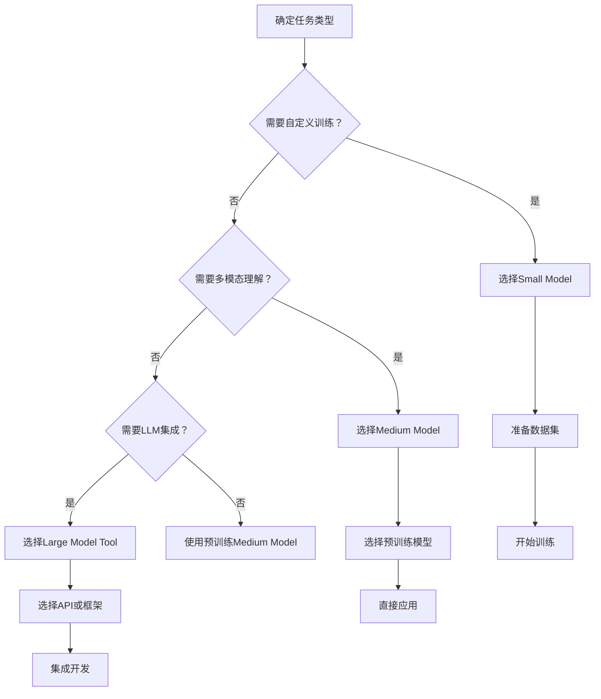

# AI Base Model - 模型详细目录

## 说明

本文件按照优化后的三层分类体系列出仓库中包含的主要模型、论文与实现链接：

- **Small Models** - 需要训练的传统模型
- **Medium Models** - 即开即用的预训练模型
- **Large Model Tools** - LLM集成的智能工具

## 📋 快速索引

### 按用途快速查找

| 需求 | 推荐模型 | 难度 | 位置 |
|------|----------|------|------|
| **入门学习** | ResNet, YOLOv8 | ⭐⭐ | [分类](#1-图像分类-classification) / [YOLO](#3-yolo系列-yolo) |
| **工业应用** | YOLOv9, SAM | ⭐⭐⭐ | [YOLO](#3-yolo系列-yolo) / [基础模型](#1-基础模型-foundation_models) |
| **科研前沿** | SAM, LLaVA, InternVL | ⭐⭐⭐⭐ | [基础模型](#1-基础模型-foundation_models) / [多模态](#2-多模态模型-multimodal) |
| **移动端** | MobileNet, YOLOv10 | ⭐⭐⭐ | [轻量分类](#2-轻量级网络) / [YOLO](#3-yolo系列-yolo) |
| **多模态对话** | LLaVA, MiniGPT-4 | ⭐⭐⭐ | [多模态](#2-多模态模型-multimodal) |
| **零样本任务** | CLIP, Grounding DINO | ⭐⭐⭐ | [基础模型](#1-基础模型-foundation_models) |
| **生成任务** | Stable Diffusion, StyleGAN3 | ⭐⭐⭐⭐ | [生成模型](#4-生成模型-generative) |

### 按难度等级查找

- **⭐ 入门级**：经典架构，文档丰富，社区支持好
- **⭐⭐ 进阶级**：性能提升，需要一定理解基础
- **⭐⭐⭐ 专业级**：复杂架构，需要调优经验
- **⭐⭐⭐⭐ 研究级**：前沿技术，需要深入理解

## 🚀 使用指南

### 1. 快速开始流程



### 2. 模型选择建议

#### 性能优先（计算资源充足）
- **分类**: ConvNeXt, EfficientNet, Swin Transformer
- **检测**: YOLOv9, YOLOX, Faster R-CNN
- **分割**: SAM, PSPNet, U-Net
- **多模态**: LLaVA, InternVL, BLIP-2

#### 效率优先（资源受限）
- **分类**: MobileNetV2, ShuffleNetV2, EfficientNet-Lite
- **检测**: YOLOv8-nano, YOLOv10-tiny, FCOS
- **分割**: BiSeNet, HRNet, Semantic FPN
- **多模态**: MiniGPT-4, BLIP-2-base

#### 速度优先（实时应用）
- **检测**: YOLOv8-nano, YOLOv10-tiny, FCOS
- **分割**: BiSeNet, Semantic FPN, YOLOv8-seg
- **跟踪**: ByteTrack, PySOT, STARK

### 3. 常见组合方案

#### 工业质检方案
```
检测: YOLOv9 (精度) → 分割: FastSAM (速度) → 跟踪: ByteTrack (关联)
```

#### 智能监控方案
```
检测: YOLOv8 (平衡) → 跟踪: DeepSORT (多目标) → 分析: CLIP (场景理解)
```

#### 医疗影像方案
```
分割: U-Net (医学专用) → 分类: ResNet (诊断) → 对话: LLaVA (辅助)
```

#### 机器人视觉方案
```
检测: YOLOv10 (端到端) → 分割: SAM (精确) → 决策: LangChain (智能体)
```

---

# 🔧 Small Models (需要训练)

## 1. 图像分类 (classification)

### 经典卷积网络

- **ResNet / ResNeXt**
  - ResNet论文：Deep Residual Learning for Image Recognition (CVPR 2016)
  - ResNeXt论文：Aggregated Residual Transformations for Deep Neural Networks (CVPR 2017)
  - 实现：`small_models/classification/classic_cnns/resnet/`
  - 特点：残差连接，解决深度网络梯度消失问题

- **VGG**
  - 论文：Very Deep Convolutional Networks for Large-Scale Image Recognition (ICLR 2015)
  - 实现：`small_models/classification/classic_cnns/vgg/`
  - 特点：简单统一的卷积网络结构

- **DenseNet**
  - 论文：Densely Connected Convolutional Networks (CVPR 2017)
  - 实现：`small_models/classification/classic_cnns/densenet/`
  - 特点：密集连接，特征复用

### 轻量级网络

- **MobileNetV2**
  - 论文：Inverted Residuals and Linear Bottlenecks (CVPR 2018)
  - 实现：`small_models/classification/lightweight_cnns/mobilenet/`
  - 特点：深度可分离卷积，移动端优化

- **ShuffleNetV2**
  - 论文：ShuffleNet V2: Practical Guidelines (ECCV 2018)
  - 实现：`small_models/classification/lightweight_cnns/shufflenetv2/`
  - 特点：通道混洗，计算效率优化

### 高性能架构

- **EfficientNet**
  - 论文：EfficientNet: Rethinking Model Scaling (ICML 2019)
  - 实现：`small_models/classification/high_performance_cnns/efficientnet/`
  - 特点：复合缩放，精度效率平衡

- **ConvNeXt**
  - 论文：A ConvNet for the 2020s (CVPR 2022)
  - 实现：`small_models/classification/high_performance_cnns/convnext/`
  - 特点：现代ConvNet设计，接近Transformer性能

- **RepVGG**
  - 论文：RepVGG: Making VGG-style ConvNets Great Again (CVPR 2021)
  - 实现：`small_models/classification/high_performance_cnns/repvgg/`
  - 特点：重参数化，部署友好

### Transformer架构

- **ViT (Vision Transformer)**
  - 论文：An Image is Worth 16x16 Words (ICLR 2021)
  - 实现：`small_models/classification/transformers_hybrids/vit/`
  - 特点：纯Transformer架构，突破性设计

- **DeiT (Data-efficient Image Transformer)**
  - 论文：Training data-efficient image transformers (ICML 2021)
  - 实现：`small_models/classification/transformers_hybrids/deit/`
  - 特点：数据高效ViT训练

- **Swin Transformer**
  - 论文：Swin Transformer: Hierarchical Vision Transformer (ICCV 2021)
  - 实现：`small_models/classification/transformers_hybrids/swin/`
  - 特点：滑动窗口，层级设计

## 2. 目标检测 (detection)

### 两阶段检测器

- **Faster R-CNN**
  - 论文：Faster R-CNN: Towards Real-Time Object Detection (NIPS 2015)
  - 实现：`small_models/detection/detection_2d/two_stage/faster_rcnn/`
  - 特点：区域提议网络，anchor-based

- **Mask R-CNN**
  - 论文：Mask R-CNN (ICCV 2017)
  - 实现：`small_models/detection/detection_2d/instance_seg/mask_rcnn_benchmark/`
  - 特点：实例分割扩展

### 单阶段检测器

- **YOLO系列 (详见YOLO部分)**

- **FCOS (Fully Convolutional One-Stage)**
  - 论文：FCOS: Fully Convolutional One-Stage Object Detection (ICCV 2019)
  - 实现：`small_models/detection/detection_2d/one_stage/fcos/`
  - 特点：无anchor，像素级预测

## 3. YOLO系列 (YOLO)

### 主要版本

- **YOLOv6**
  - 论文：YOLOv6: A Single-Stage Object Detection Framework for Industrial Applications (2022)
  - 实现：`small_models/YOLO/yolov6/`
  - 特点：美团工业级优化，高精度

- **YOLOv7**
  - 论文：YOLOv7: Trainable bag-of-freebies sets new state-of-the-art (2023)
  - 实现：`small_models/YOLO/yolov7/`
  - 特点：原作者延续，性能优异

- **YOLOv8**
  - 实现：`small_models/YOLO/yolov8/` (Ultralytics)
  - 特点：统一框架，易用性强

- **YOLOv9**
  - 论文：YOLOv9: Learning What You Want to Learn (2024)
  - 实现：`small_models/YOLO/yolov9/`
  - 特点：最新架构，精度提升

- **YOLOv10**
  - 论文：YOLOv10: Real-Time End-to-End Object Detection (2024)
  - 实现：`small_models/YOLO/yolov10/`
  - 特点：清华大学版本，端到端

- **YOLOv11**
  - 实现：`small_models/YOLO/yolov11/`
  - 特点：最新版本，持续优化

- **YOLOX**
  - 论文：YOLOX: Exceeding YOLO Series in 2021 (2021)
  - 实现：`small_models/YOLO/yolox/`
  - 特点：旷视科技，anchor-free

## 4. 图像分割 (segmentation)

### 经典语义分割 (classic_seg)

- **FCN (Fully Convolutional Networks)**
  - 论文：Fully Convolutional Networks for Semantic Segmentation (CVPR 2015)
  - 实现：`small_models/segmentation/classic_seg/fcn/`
  - 特点：全卷积，端到端分割

- **U-Net**
  - 论文：U-Net: Convolutional Networks for Biomedical Image Segmentation (MICCAI 2015)
  - 实现：`small_models/segmentation/classic_seg/unet/`
  - 特点：编码器-解码器，跳跃连接

- **PSPNet (Pyramid Scene Parsing)**
  - 论文：Pyramid Scene Parsing Network (CVPR 2017)
  - 实现：`small_models/segmentation/classic_seg/pspnet/`
  - 特点：金字塔池化，场景理解

### Transformer分割 (transformer_panoptic)

- **Mask2Former**
  - 论文：Masked-attention Mask Transformer for Universal Image Segmentation (CVPR 2022)
  - 实现：`small_models/segmentation/transformer_panoptic/mask2former/`
  - 特点：通用图像分割，语义/实例/全景统一

- **SegFormer**
  - 论文：SegFormer: Simple and Efficient Design for Semantic Segmentation with Transformers (NeurIPS 2021)
  - 实现：`small_models/segmentation/transformer_panoptic/segformer/`
  - 特点：轻量级Transformer分割，多尺度特征

## 5. 目标跟踪 (tracking)

### 多目标跟踪 (MOT)

- **DeepSORT**
  - 论文：Simple Online and Realtime Tracking (2017)
  - 实现：`small_models/tracking/mot/deepsort/`
  - 特点：深度特征关联，实时跟踪

- **ByteTrack**
  - 论文：ByteTrack: Multi-Object Tracking by Associating Every Detection Box (2021)
  - 实现：`small_models/tracking/mot/bytetrack/`
  - 特点：检测关联，简单高效

### 单目标跟踪 (SOT)

- **PySOT (SiamRPN++)**
  - 论文：SiamRPN++: Evolution of Siamese Visual Tracking with Very Deep Networks (CVPR 2019)
  - 实现：`small_models/tracking/sot/pysot/`
  - 特点：孪生网络，深度特征跟踪

- **SiamMask**
  - 论文：Fast Online Object Tracking and Segmentation (CVPR 2019)
  - 实现：`small_models/tracking/sot/siammask/`
  - 特点：跟踪分割一体化

---

# 🎯 Medium Models (即开即用)

## 1. 基础模型 (foundation_models)

### 通用分割

- **SAM (Segment Anything Model)**
  - 论文：Segment Anything (ICCV 2023)
  - 实现：`medium_models/foundation_models/sam/`
  - 特点：零样本通用分割，提示驱动
  - 权重下载：https://github.com/facebookresearch/segment-anything#model-checkpoints

### 检测模型

- **DINO/DETR**
  - DETR论文：End-to-End Object Detection with Transformers (ECCV 2020)
  - DINO论文：DINO: DETR with Improved DeNoising Anchor Boxes (ICLR 2023)
  - 实现：`medium_models/foundation_models/detr/`
  - 特点：端到端Transformer检测

- **Grounding DINO**
  - 论文：Open-Set Object Detection (ICCV 2023)
  - 实现：`medium_models/foundation_models/grounding_dino/`
  - 特点：开放词汇检测，文本引导
  - 权重下载：https://github.com/IDEA-Research/GroundingDINO#model-checkpoints

### 多模态理解

- **CLIP (Contrastive Language-Image Pre-training)**
  - 论文：Learning Transferable Visual Models From Natural Language Supervision (ICML 2021)
  - 实现：`medium_models/foundation_models/clip/`
  - 特点：图文对比学习，零样本分类
  - 权重：自动下载

## 2. 多模态模型 (multimodal)

### 视觉语言助手

- **LLaVA (Large Language and Vision Assistant)**
  - 论文：Visual Instruction Tuning (NeurIPS 2023)
  - 实现：`medium_models/multimodal/llava/`
  - 特点：视觉指令微调，对话式理解
  - 权重下载：https://github.com/haotian-liu/LLaVA#model-checkpoints

- **MiniGPT-4**
  - 论文：MiniGPT-4: Enhancing Vision-Language Understanding (2023)
  - 实现：`medium_models/multimodal/minigpt4/`
  - 特点：轻量级GPT-4，高效推理

### 图文理解

- **BLIP-2**
  - 论文：BLIP-2: Bootstrapping Language-Image Pre-training (ICCV 2023)
  - 实现：`medium_models/multimodal/blip2/`
  - 特点：引导预训练，图文检索

- **InternVL**
  - 论文：InternVL: Towards Open-World Vision-Language Understanding (2024)
  - 实现：`medium_models/multimodal/internvl/`
  - 特点：开源视觉语言模型，开放世界理解

## 3. 零样本模型 (zero_shot)

### 开放词汇检测

- **OWL-ViT**
  - 论文：Open-vocabulary Object Detection (ICCV 2022)
  - 实现：`medium_models/zero_shot/owl_vit/`
  - 特点：开放世界定位，文本描述检测

## 4. 生成模型 (generative)

### GAN系列

- **StyleGAN3**
  - 论文：Alias-Free Generative Adversarial Networks (CVPR 2021)
  - 实现：`medium_models/generative/stylegan3/`
  - 特点：高保真图像生成，改进别名问题

- **StyleGAN-T**
  - 论文：StyleGAN-T: Unlocking the Power of GANs for Fast Large-Scale Text-to-Image Synthesis (ICLR 2023)
  - 实现：`medium_models/generative/stylegan-t/`
  - 特点：文本到图像生成

### 扩散模型

- **DDPM (Denoising Diffusion Probabilistic Models)**
  - 论文：Denoising Diffusion Probabilistic Models (NIPS 2020)
  - 实现：`medium_models/generative/ddpm/`
  - 特点：去噪扩散，概率生成模型

- **Stable Diffusion**
  - 实现：`medium_models/generative/stable-diffusion/`
  - 特点：潜在空间扩散，文本到图像

- **Latent Diffusion**
  - 论文：High-Resolution Image Synthesis with Latent Diffusion Models (CVPR 2022)
  - 实现：`medium_models/generative/latent-diffusion/`
  - 特点：潜空间扩散，高效生成

### VAE系列

- **VQ-VAE**
  - 论文：Neural Discrete Representation Learning (NIPS 2017)
  - 实现：`medium_models/generative/vq-vae/`
  - 特点：向量量化变分自编码器

- **VQGAN**
  - 论文：Taming Transformers for High-Resolution Image Synthesis (ICCV 2021)
  - 实现：`medium_models/generative/vqgan/`
  - 特点：VQ与GAN结合

- **MaskGIT**
  - 论文：MaskGIT: Scalable Masked Image Modeling (ICLR 2022)
  - 实现：`medium_models/generative/maskgit/`
  - 特点：掩码生成图像Transformer

---

# 🤖 Large Model Tools (智能工具)

## 1. 视觉智能体 (vision_agents)

### 智能体框架

- **LangChain**
  - 实现：`large_model_tools/vision_agents/langchain/`
  - 特点：LLM应用开发框架，支持视觉工具集成
  - 用途：构建复杂视觉工作流，多工具协调

- **CrewAI**
  - 实现：`large_model_tools/vision_agents/crewai/`
  - 特点：多智能体协作框架
  - 用途：团队式AI视觉任务处理

- **LlamaIndex**
  - 实现：`large_model_tools/vision_agents/llamaindex/`
  - 特点：数据检索增强生成(RAG)，视觉知识库
  - 用途：视觉问答，文档理解

## 2. LLM视觉工具 (llm_vision_tools)

### API集成

- **OpenAI Vision API**
  - 实现：`large_model_tools/llm_vision_tools/openai_vision/`
  - 特点：GPT-4V视觉理解能力
  - 用途：高级视觉分析，场景理解

- **Claude Vision API**
  - 实现：`large_model_tools/llm_vision_tools/claude_vision/`
  - 特点：Claude-3视觉能力，高精度分析
  - 用途：详细图像描述，推理分析

- **Hugging Face Transformers**
  - 实现：`large_model_tools/llm_vision_tools/transformers/`
  - 特点：丰富的预训练模型生态
  - 用途：多种视觉任务API接口

## 3. 自动化工具 (automation)

### 快速原型

- **Gradio**
  - 实现：`large_model_tools/automation/gradio_vision/`
  - 特点：快速机器学习界面
  - 用途：模型演示，交互式Web应用

- **Streamlit**
  - 实现：`large_model_tools/automation/streamlit_vision/`
  - 特点：数据应用Web框架
  - 用途：可视化应用，仪表板

### 可视化工作流

- **ComfyUI**
  - 实现：`large_model_tools/automation/comfyui/`
  - 特点：节点式视觉工作流
  - 用途：复杂AI流程可视化构建

---

## 📊 模型统计

| 分类 | 子类 | 模型数量 | 文件数 |
|------|------|----------|--------|
| Small Models | 5 | 50+ | 33,211 |
| ├── Classification | 4 | 15+ | 10,911 |
| ├── Detection | 3 | 10+ | 10,972 |
| ├── Segmentation | 2 | 8+ | 6,115 |
| ├── Tracking | 2 | 6+ | 2,433 |
| └── YOLO | 7 | 7 | 2,780 |
| Medium Models | 4 | 20+ | 5,639 |
| ├── Foundation | 4 | 4+ | 191 |
| ├── Multimodal | 4 | 4+ | 2,716 |
| ├── Zero-shot | 1 | 1+ | 1,065 |
| └── Generative | 3 | 10+ | 1,667 |
| Large Model Tools | 3 | 9+ | 33,484 |
| ├── Vision Agents | 3 | 3+ | 15,829 |
| ├── LLM Vision Tools | 3 | 3+ | 5,168 |
| └── Automation | 3 | 3+ | 12,487 |

## 📝 贡献说明

### 添加新模型
1. 确定模型所属分类（Small/Medium/Large）
2. 在对应目录添加模型实现
3. 更新本文件添加模型条目
4. 提供论文链接和简要说明
5. 测试基本功能可用性

### 质量标准
- 模型必须有明确的论文引用
- 代码来自官方或权威实现
- 包含基本的安装和使用说明
- 通过基本功能测试

---

**最后更新：2024年12月**  
**总模型数：80+个**  
**总文件数：72,000+个**